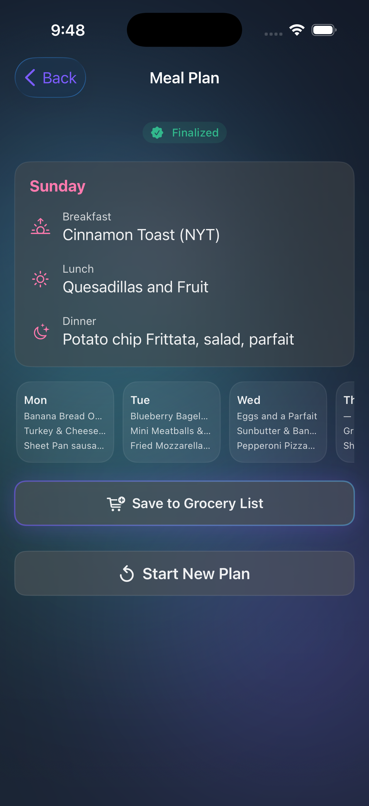
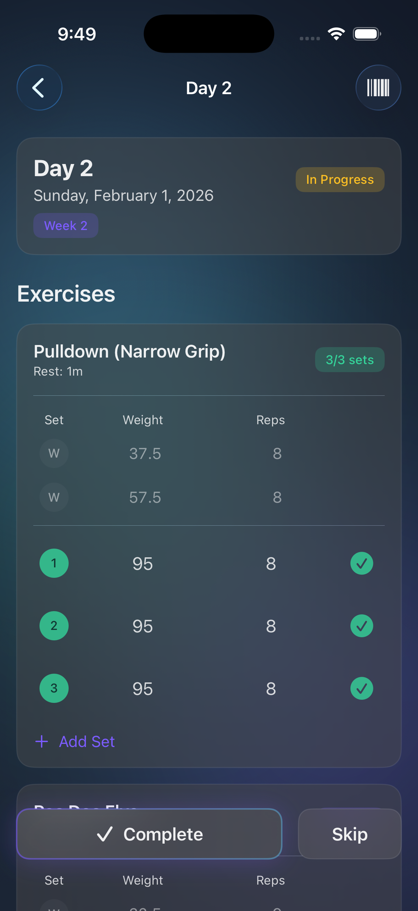
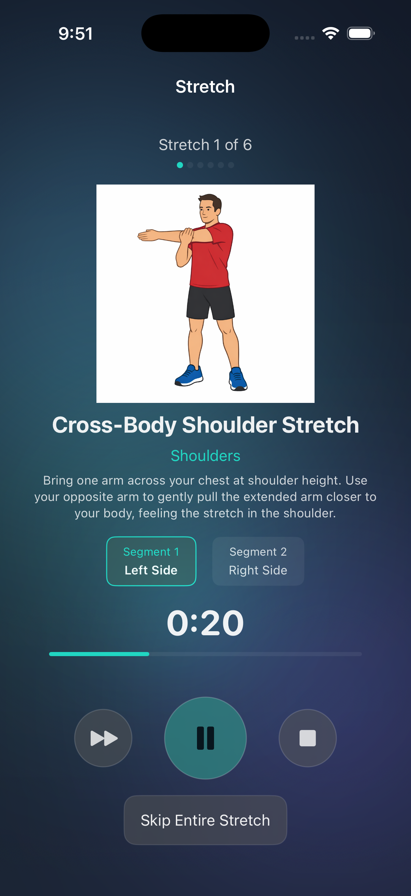
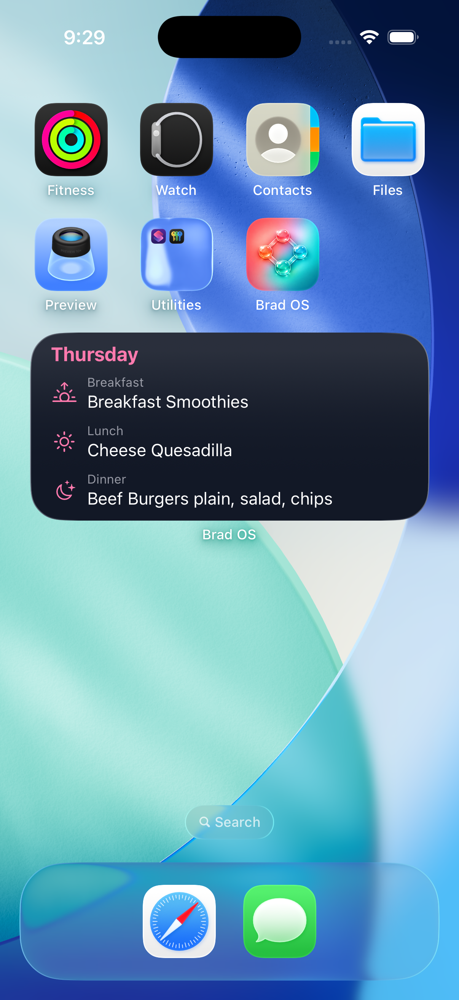

# brad-os

A personal operating system for tracking wellness and fitness. Built as a learning project that I actually use daily. Currently focused on workouts, stretching, meditation, and meal planning—will expand as needed.

## Screenshots

<p align="center">
  
  
  
  
</p>

## Features

### 🍽️ Meal Planning
- Weekly meal plans with breakfast, lunch, and dinner
- Generate grocery lists from meal plans
- Home screen widget showing today's meals at a glance
- Disk cache with App Group sharing for instant widget updates

### 🏋️ Weightlifting
- 6-week mesocycle training with automatic progression
- Track warmup sets and working sets
- Real-time workout tracking with rest timers

### 🧘 Guided Stretching
- Target specific body regions (neck, shoulders, back, hip flexors, glutes, hamstrings, quads, calves)
- Customizable duration per region (1-2 minutes)
- Session timer with progress tracking
- Optional Spotify playlist integration

### 🧠 Meditation
- Configurable meditation timer
- Simple, distraction-free interface
- Session history tracking

### 📅 Activity Dashboard
- Today view showing current meal plan and active workouts
- Unified calendar of all activities
- Quick access to all wellness features
- Activity history and streaks

## Architecture

```text
brad-os/
├── ios/BradOS/          # Native SwiftUI app (iPhone, Apple Watch, Widget)
│   ├── BradOS/          # Main iOS app
│   ├── BradOSCore/      # Shared Swift package (models, networking)
│   ├── BradOSWatch/     # watchOS companion (workout tracking)
│   └── BradOSWidget/    # Home screen widget (meal plan)
├── packages/functions/  # Firebase Cloud Functions (Express + Firestore)
├── scripts/             # Build, validation, and tooling scripts
└── docs/                # Architecture maps, conventions, guides
```

- **iOS App** — SwiftUI targeting iPhone and Apple Watch. XcodeGen manages the project file from `project.yml`. BradOSCore is a local Swift package for shared models and the API client.
- **Backend** — Express apps deployed as Firebase Cloud Functions (Node 22). Each API domain (health, exercises, plans, mesocycles, workouts, meals, cycling, etc.) is a separate function with dev/prod variants. Firestore is the database.
- **Monorepo** — npm workspaces. TypeScript types, Zod schemas, and tests live alongside handlers in `packages/functions/src/`.

## Development

```bash
npm install              # Install dependencies
npm run dev              # Build functions + start Firebase emulators (Firestore, Functions, Hosting)
npm run validate         # Full check: typecheck + lint + test + architecture
npm run validate:quick   # Fast check: typecheck + lint only
npm run typecheck        # TypeScript compilation
npm run lint             # ESLint (use --fix to auto-fix)
npm test                 # Unit tests (vitest)
```

### Deploying

```bash
npm run deploy:functions:dev   # Deploy dev functions to Firebase
npm run deploy:functions:prod  # Deploy prod functions to Firebase
```

## iOS App

The iOS project uses [XcodeGen](https://github.com/yonaskolb/XcodeGen) — regenerate the Xcode project after changing `project.yml`:

```bash
cd ios/BradOS && xcodegen generate && cd ../..
```

Build for simulator:

```bash
xcodebuild -project ios/BradOS/BradOS.xcodeproj \
  -scheme BradOS \
  -destination 'platform=iOS Simulator,name=iPhone 17 Pro' \
  -derivedDataPath ~/.cache/brad-os-derived-data \
  -skipPackagePluginValidation \
  build
```

## CI

GitHub Actions runs on every push to `main` and PR:

1. **Validate** — `npm run validate` (typecheck + lint + test + architecture)
2. **Integration** — Firebase emulators + `npm run test:integration`
