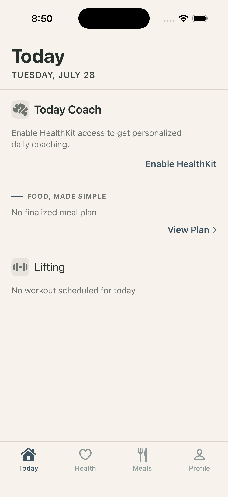
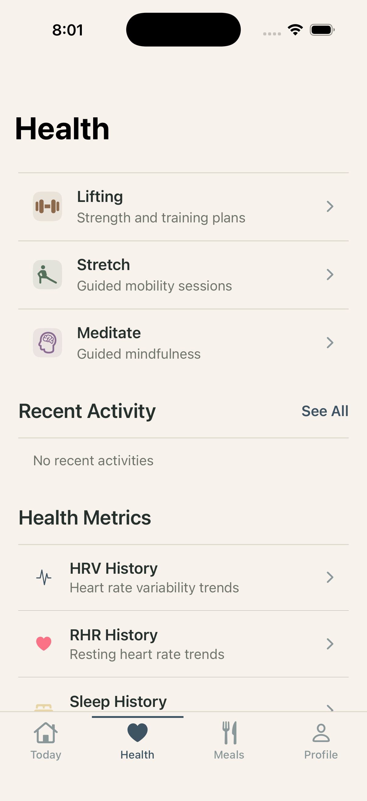
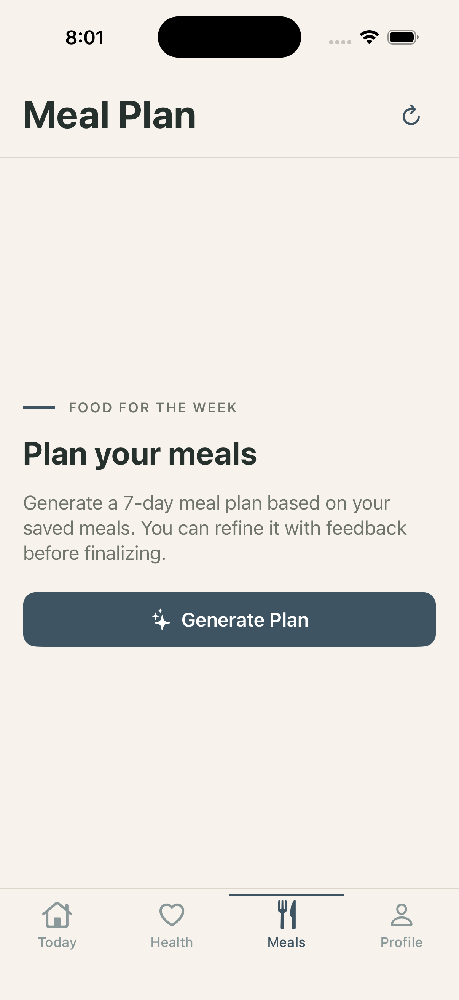
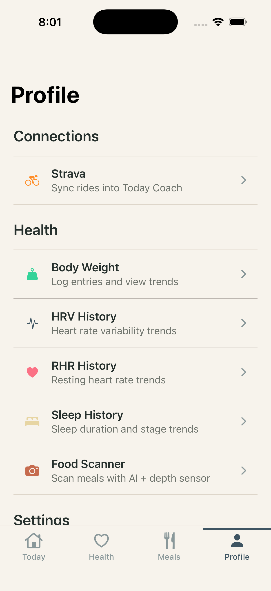

# brad-os

A personal operating system for tracking wellness and fitness. Built as a learning project that I actually use daily. Currently focused on workouts, stretching, meditation, and meal planning—will expand as needed.

## Screenshots

<p align="center">
  
  
  
  
</p>

## Features

### 🍽️ Meal Planning
- Weekly meal plans with breakfast, lunch, and dinner
- Generate grocery lists from meal plans
- Home screen widget showing today's meals at a glance
- Disk cache with App Group sharing for instant widget updates

### 🏋️ Weightlifting
- 6-week mesocycle training with automatic progression
- Track warmup sets and working sets
- Real-time workout tracking with rest timers

### 🧘 Guided Stretching
- Target specific body regions (neck, shoulders, back, hip flexors, glutes, hamstrings, quads, calves)
- Customizable duration per region (1-2 minutes)
- Session timer with progress tracking
- Optional Spotify playlist integration

### 🧠 Meditation
- Configurable meditation timer
- Simple, distraction-free interface
- Session history tracking

### 📅 Activity Dashboard
- Today view showing current meal plan and active workouts
- Unified calendar of all activities
- Quick access to all wellness features
- Activity history and streaks

## Architecture

```text
brad-os/
├── ios/BradOS/          # Native SwiftUI iOS app (XcodeGen project)
│   ├── BradOS/          # Main app target
│   ├── BradOSCore/      # Shared framework (models, services)
│   ├── BradOSWatch/     # watchOS companion
│   ├── BradOSWidget/    # Home screen widgets
│   └── project.yml      # XcodeGen spec
├── packages/functions/  # Unified Express API: Cloud Run + standalone local runtime
│   └── src/
│       ├── handlers/    # Express route handlers
│       ├── schemas/     # Zod validation schemas
│       ├── types/       # Shared TypeScript types
│       └── services/    # Business logic
├── docs/                # Conventions, architecture maps, guides
└── scripts/             # Dev tooling (validate, QA, deploy, lint)
```

- **iOS App** — SwiftUI app with shared APIClient, App Check auth, and HealthKit integration
- **Cloud Run API** — One scale-to-zero Express service serves `/api/dev` and `/api/prod`, backed by Firestore
- **Production Routing** — Firebase Hosting sends `/api/**` to Cloud Run; no Firebase Functions are deployed
- **Local QA** — The same Express service runs on loopback and uses the real `dev_*` Firestore namespace; automated integration tests use only the Firestore emulator

## Development

See **[Local Dev Quickstart](docs/guides/local-dev-quickstart.md)** for the full 5-minute bootstrap flow.

```bash
npm install              # Install dependencies (also sets up git hooks)
npm run validate         # Full check: typecheck + lint + test + architecture
npm run qa:start         # Launch simulator + standalone API + OTel
npm run build            # Build the unified API
npm run test:integration:emulator # Standalone API + disposable Firestore emulator
npm run test:integration:container # Build and smoke-test the Cloud Run image
npm run typecheck        # TypeScript compilation
npm run lint             # Oxlint checks
npm run lint:cleanup:ts-eslint:list # Scoped TypeScript eslint cleanup profiles
npm run test             # Unit tests
```

## iOS App

See **[iOS Build and Run](docs/guides/ios-build-and-run.md)** for the full guide.

```bash
# Generate Xcode project from project.yml
cd ios/BradOS && xcodegen generate && cd ../..

# Build for simulator
xcodebuild -project ios/BradOS/BradOS.xcodeproj \
  -scheme BradOS \
  -destination 'platform=iOS Simulator,name=iPhone 17 Pro' \
  -derivedDataPath ~/.cache/brad-os-derived-data \
  -skipPackagePluginValidation \
  build

# Install and launch
xcrun simctl install booted ~/.cache/brad-os-derived-data/Build/Products/Debug-iphonesimulator/BradOS.app
xcrun simctl launch booted com.bradcarter.brad-os
```
